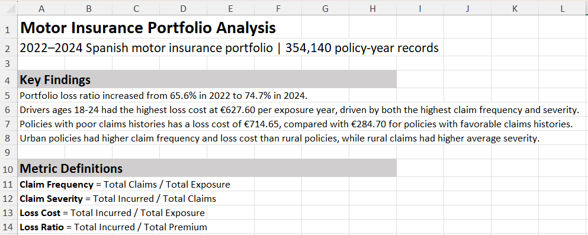
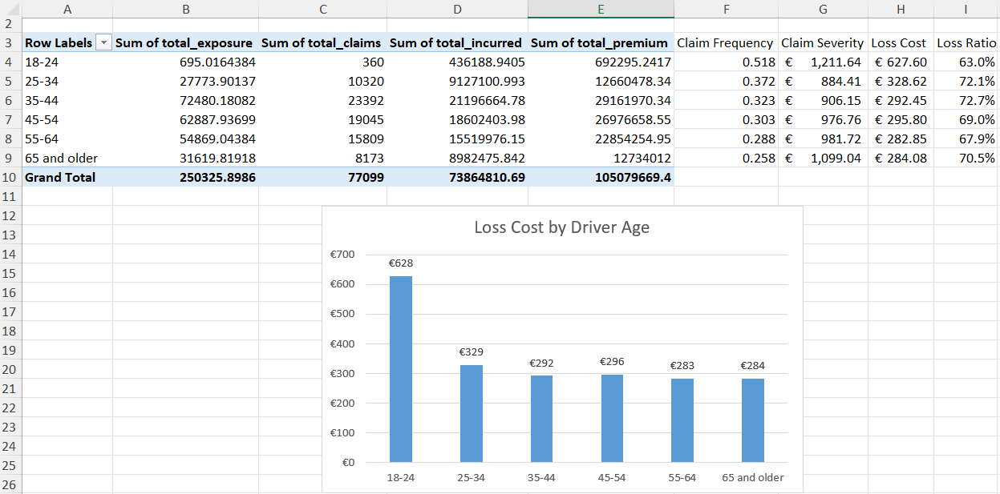
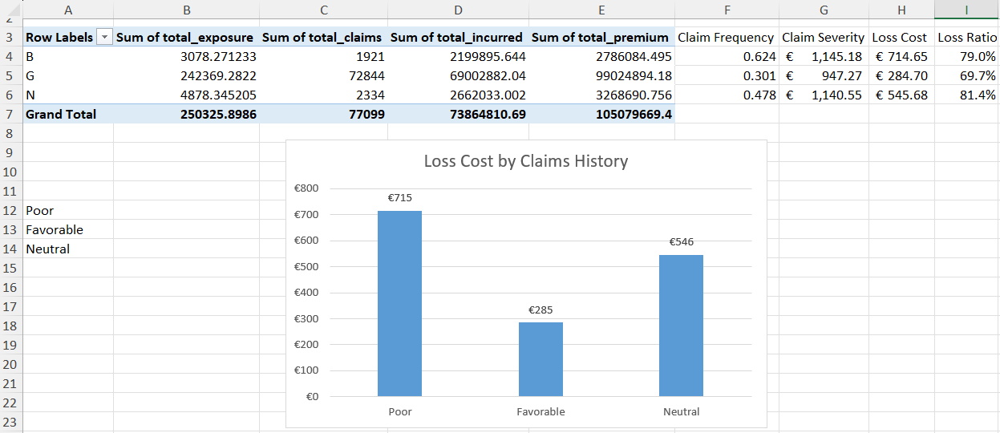

# Auto Insurance Portfolio Analysis

## Project Overview

This project analyzes a 2022–2024 auto insurance portfolio using Excel to evaluate claim frequency, claim severity, loss cost, and loss ratio across several risk characteristics. The analysis uses Power Query for data preparation, PivotTables for aggregation, and Excel formulas and charts to compare results across driver age, claims history, and urban/rural area.

## Dataset

The analysis uses a dataset of 354,140 motor insurance policy-year observations from a Spanish insurer covering 2022–2024. The dataset includes policy characteristics, driver and vehicle information, premiums, claims, incurred losses, and exposure.

Source: *A detailed dataset of motor insurance policies with coverage-specific financial information* (2026), available through [Mendeley Data](https://doi.org/10.17632/sw4jmdb2sm.1).

## Metrics

- **Claim Frequency** = Total Claims / Total Exposure
- **Claim Severity** = Total Incurred Losses / Total Claims
- **Loss Cost** = Total Incurred Losses / Total Exposure
- **Loss Ratio** = Total Incurred Losses / Total Premium

## Excel Analysis

- Imported and cleaned the source data with Power Query, including handling missing values and data-type errors.
- Used PivotTables and formulas to calculate claim frequency, severity, loss cost, and loss ratio by year and selected risk characteristics.
- Compared results across driver age, claims history, and urban/rural area and created charts to highlight the main differences.

## Key Findings

- Portfolio loss ratio increased from 65.6% in 2022 to 74.7% in 2024.
- Drivers ages 18–24 had the highest loss cost at €627.60 per exposure year, driven by both the highest claim frequency and severity.
- Policies with poor claims histories had a loss cost of €714.65, compared with €284.70 for policies with favorable claims histories.
- Urban policies had higher claim frequency and loss cost than rural policies, while rural claims had higher average severity.

## Workbook

The complete Excel workbook is included in this repository as `Auto_Insurance_Analysis.xlsx`. It contains:

- A summary of the key findings and metric definitions.
- Annual portfolio results for 2022–2024.
- Analyses by driver age, claims history, and urban/rural area.
- PivotTables, formulas, and charts supporting the analysis.
- The cleaned analysis data and Power Query connections used to prepare the dataset.

Because of the workbook's file size, GitHub may not display a browser preview. The file can be downloaded and opened in Excel to view the complete analysis.

## Analysis Preview

### Portfolio Summary

### Driver Age Analysis

### Claims History Analysis

